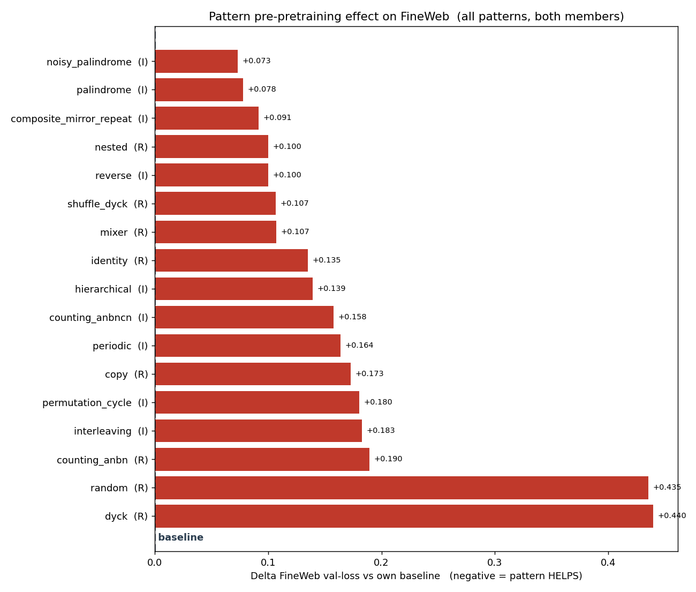
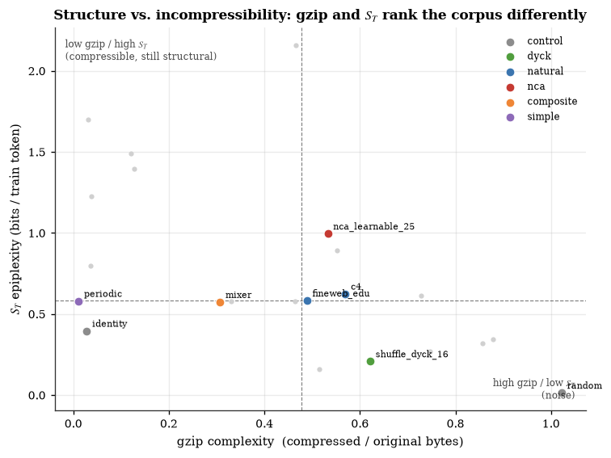
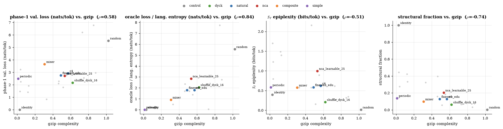
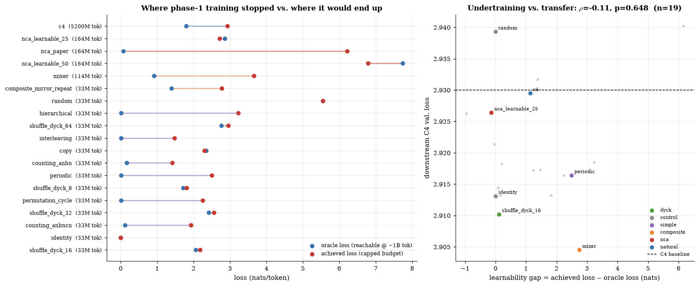
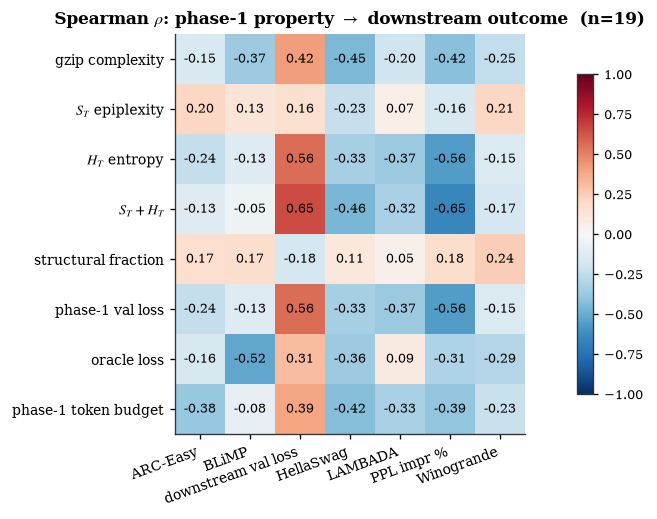
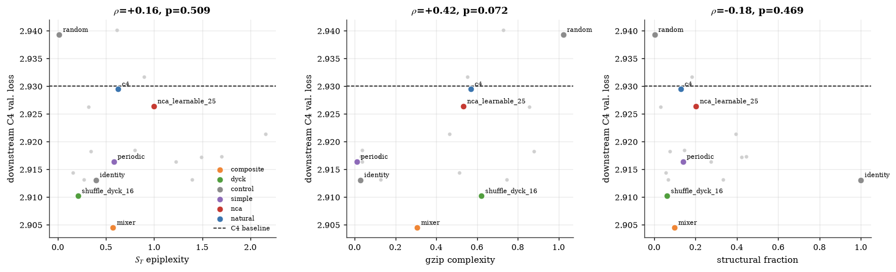
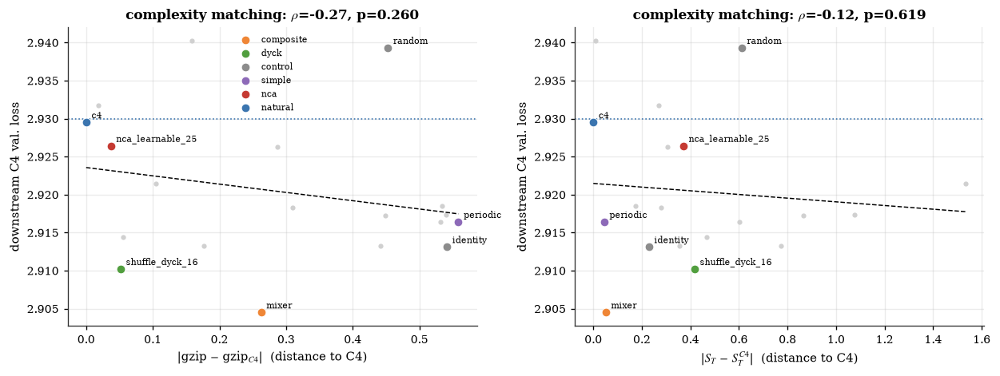
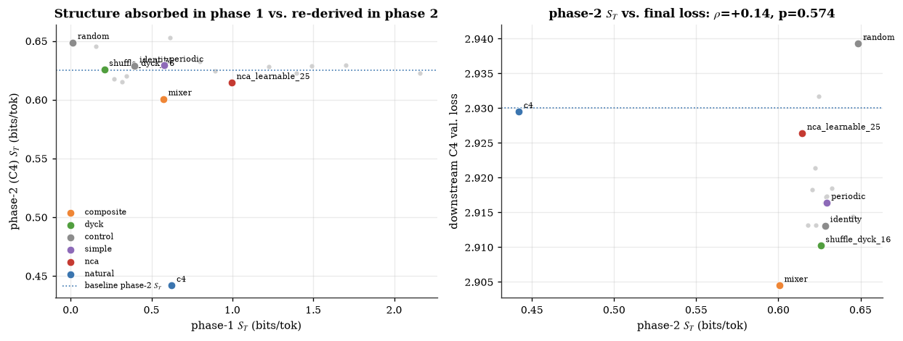
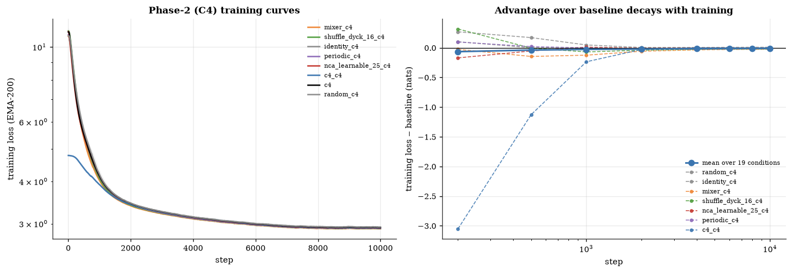

# Complexity-Guided Pre-Pretraining

## Main Idea

Using patterns as a "surrogate language" in "pre-pretraining" can significantly enhance the performance of language models on downstream tasks. In essence, this approach involves teaching the model to understand simple and complex patterns before exposing them to natural language. This exposure allows the model to learn useful representations related to sequence modeling, which can be (hypothetically) beneficial for various downstream tasks.

Some papers already explored this idea:

* [Program Synthesis using Natural Language](https://arxiv.org/abs/1509.00413)
* [Analysing Mathematical Reasoning Abilities of Neural Models](https://arxiv.org/abs/1904.01557)
* [Pre-Training a Language Model Without Human Language](https://arxiv.org/abs/2012.11995)
* [Injecting structural hints: Using language models to study inductive biases in language learning](https://arxiv.org/abs/2304.13060)
* [LifeGPT: Topology-Agnostic Generative Pretrained Transformer Model for Cellular Automata](https://arxiv.org/abs/2409.12182)

The most promising results come from the last two papers:

* [Training Language Models via Neural Cellular Automata](https://arxiv.org/html/2603.10055v1) -> Uses Neural Cellular Automata (NCA) to generate complex patterns for pre-pretraining. Just 160M tokens of NCA-generated data can lead to significant improvements in downstream performance.
* [Between Circuits and Chomsky: Pre-pretraining on Formal Languages Imparts Linguistic Biases](https://arxiv.org/html/2502.19249v2) -> Uses formal languages (e.g., Dyck languages) to pre-pretrain language models, showing that this can impart linguistic biases and improve performance on downstream tasks.

Bottom line:

> "Richly structured non-linguistic data could also be effective for teaching models useful capabilities, and may be more efficient to learn from than natural language data."

## Why this is cool for low-resource / data constrained settings

Data is not always abundant. For many low-resource languages, domains, or tasks, we may not have access to large amounts of natural language data. In such cases, pre-pretraining on synthetic patterns can provide a valuable alternative. By learning to recognize and generate patterns, the model can develop a strong foundation in sequence modeling, which can then cascade into improved performance on downstream tasks, even with limited natural language data. Since this type of data can be generated in "unlimited" quantities, it can be a powerful tool for enhancing model performance in data-constrained settings.

## What we would like to investigate

* What types of patterns are most effective for pre-pretraining?
* How does the complexity of the patterns affect downstream performance?
* How does the amount of pattern data used for pre-pretraining impact downstream performance?
* How does pre-pretraining on patterns compare to pre-pretraining on natural language data in terms of downstream performance?

Other things that would be interesting to investigate:

* How model arquitecture (e.g. transformer vs. hybrid models) interacts with pre-pretraining on patterns.
* How different types of downstream tasks (e.g. language understanding vs. mathematical reasoning) are affected by pre-pretraining on patterns.
* How different language families (e.g. english vs. chinese) are affected by pre-pretraining on patterns.

## How we can measure complexity of patterns

The most straightforward way to measure the complexity of a pattern is to look at its [Kolmogorov complexity](https://liamzebedee.com/maths/papers/kolomogrov-tables-random-numbers.pdf) (i.e., a good approximation of the length of the shortest program that can generate the pattern, since $K$ is uncomputable).

## Example

* Generate a sequence of tokens using some function (e.g. a neural cellular automata, a formal language, etc.).
* Serialize and compress the sequence using **gzip**.
* We can measure the **complexity** of a sequence by the ratio of compressed size to original size:

$$\text{complexity} = \frac{\text{compressed bytes}}{\text{original bytes}}$$

* Or, we can also talk about the compression ratio, which is the inverse of complexity:

$$\text{compression ratio} = \frac{\text{original bytes}}{\text{compressed bytes}}$$

The intuition is that gzip compression approximates **Kolmogorov complexity**:

* Highly compressible sequences contain regular, predictable structure.
* Poorly compressible sequences are more chaotic and information-rich.

Note: ***"matching the complexity of synthetic pre-training data to the target domain maximizes transfer."**** This means that if we want to improve performance on natural language tasks, we should pre-pretrain on patterns that have a similar level of complexity to natural language data ([source](https://arxiv.org/abs/2603.10055)).

## Experimental setup

A proper ablation study would involve:

* Training a language model from scratch on a fixed text dataset for a fixed number of steps / tokens.
  * 5-10 billion tokens of natural language data could be a good place to start.
  * [c4](https://huggingface.co/datasets/allenai/c4) is a good candidate for the text dataset. Is a little less clean than Fineweb-Edu, but is cvan nserve as a contrast to see how pre-pretraining on patterns affects performance on a noisier dataset.
  * [Fineweb-Edu](https://huggingface.co/datasets/HuggingFaceFW/fineweb-edu#smaller-sample-versions) is a good candidate for the text dataset since it is relatively clean and of high quality.
  * [Open-Web-Math](https://huggingface.co/datasets/open-web-math/open-web-math) is a good candidate for the text dataset if we want to test on more math-heavy data.
  * [CodeParrot](https://huggingface.co/datasets/codeparrot/codeparrot-clean) is a good candidate for the text dataset if we want to test on more code-heavy data.
  * [FineWeb-2](https://huggingface.co/datasets/HuggingFaceFW/fineweb-2) is a good candidate for the text dataset if we want to test on more than just English data.
    * Suggestions of languages that are very different from one another:
      * English (Indo-European, SVO word order, Latin script)
      * Chinese (Sino-Tibetan, SVO word order, logographic script)
      * Arabic (Afro-Asiatic, VSO word order, abjad script)
      * Hindi (Indo-European, SOV word order, Devanagari script)
      * Japanese (Japonic, SOV word order, mixed script)
* Pre-pretraining the model on a fixed amount of pattern data before training on the text dataset.
* Compare how our evaluations differ as we tweak the level of complexity of the pre-pretraining patterns, and amount of pre-pretraining data used.
* We could also ablate different proportions of the pre-pretraining data (e.g. 0%, 25%, 50%) and natural language data (e.g. 100%, 75%, 50%) to see how the two interact.
* We should keep comparisons fair by controlling for the total amount of training data (pattern + natural language) and total number of training steps / tokens across all conditions.
* For model architecture, we use a simple transformer-based language model (e.g. Llama2) to keep things manageable.
* For sizes, we can test a coulple of scales (e.g., 100M, 350M, 500M, 1B, 2B) to see how the effects of pre-pretraining on patterns scale with model size.
  * We expect that the benefits of pre-pretraining on patterns will be more pronounced for smaller models, and decrease as model size increases (see [source](https://arxiv.org/html/2603.10055v1#S5)).
* A softmax-attention transformer vs. a hybrid model (e.g., use Qwen3.5 as a base) would be interesting to compare, but maybe we can save that for a follow-up project.
* For the pre-pretraining patterns, we don't really need a tokenizer since we can just generate sequences of token IDs directly.
* When we move to natural language pretraining, we should:
    * Use a standard tokenizer (e.g., `HuggingFaceTB/SmolLM2-135M`).
    * We re-initialize (and re-size) the model's embedding layer to match the tokenizer's vocabulary size, and randomly initialize the new parameters.
    * If we follow the results and insights from [source](https://arxiv.org/html/2603.10055v1#S5), we should only maintain the attention weights accross the pre-pretraining and pre-training phases, and re-initialize all other parameters (e.g. feedforward layers, layer norms, etc.) to ensure that any benefits we see are due to the attention patterns learned during pre-pretraining. ***"[...] attention layers learn general-purpose mechanisms for tracking dependencies and inferring latent rules, while MLP layers specialize in storing domain-specific patterns and statistics. This division may explain why attention transfers universally from NCA to language, whereas MLP weights can introduce interference when the source and target domains differ substantially."***

* Training hyperparameters (batch size & learning rate from scaling laws, see [source](https://arxiv.org/abs/2401.02954)):

| Hyperparameter  (670M)      | Pre-pre-training                     | Pre-training                                 |
|-----------------------------|--------------------------------------|----------------------------------------------|
| Effective batch size        | 128 samples (524K tokens)            | 128 samples (524K tokens)                    |
| Sequence length             | 4096 tokens                          | 4096 tokens                                  |
| Learning rate               | $1\times10^{-3}$                     | $1\times10^{-3}$                             |
| LR schedule                 | Cosine w/ warmup                     | Cosine w/ warmup                             |
| Training steps              | 2000 steps (1B tokens)               | 10000 steps (5.2B tokens)                    |
| Warmup steps (% total)      | 200 (10%)                            | 1000 (10%)                                   |
| Weight decay                | 0.1                                  | 0.1                                          |
| Gradient clipping           | 1.0                                  | 1.0                                          |
| Precision                   | bfloat16                             | bfloat16                                     |
| Optimizer                   | AdamW ($\beta_1{=}0.9, \beta_2{=}0.95$) | AdamW ($\beta_1{=}0.9, \beta_2{=}0.95$)   |
| GPUs                        | 2× A100 or 4 x A40                   | 2× A100 or 4 x A40                           |

Note: We should run every training condition with multiple random seeds (e.g. >=3) to ensure that our results are robust and not due to random chance.

## How can we measure the "usefulness" of patterns for pre-pretraining?

Performance. We can measure a couple of things:

* Final perplexity on a held out validation set of natural language data. We can also use different types of natural language data (e.g. normal text vs. code vs. math) to see how pre-pretraining on patterns affects the performance on different types of downstream data.
* Convergence speed during pre-training. We can track the training loss and perplexity on the natural language data during pre-training to see if pre-pretraining on patterns leads to faster convergence.
* Simple benchmarks that have good "signal" at early stages of training (e.g. [HellaSwag](https://arxiv.org/abs/1905.07830), [PIQA](https://arxiv.org/abs/1911.11641), [LAMBADA](https://cdn.openai.com/better-language-models/language_models_are_unsupervised_multitask_learners.pdf), etc.). This allows us to track the improvement in downstream performance.

We could but would be more complicated:

* Finetune on a downstream task (e.g. [GSM8K](https://arxiv.org/abs/2205.12646)) and evaluate performance on that task. This would be more troublesome to do, but not too difficult if we stick to a simple SFT and tasks that have a good train/test split.

## What patterns should we use for pre-pretraining?

### Baseline patterns

These are simple patterns that can be generated with a small amount of code and are intended to serve as unstructured baselines or controls. Random will by definition have the highest complexity, while identity will have the lowest complexity (zero-entropy floor):

| Pattern                   | Schematic example          | What it probes                                                                  |
|---------------------------|----------------------------|---------------------------------------------------------------------------------|
| `random`                  | `qZ7ξ%`                    | Uniformly random tokens (unstructured baseline / control).                      |
| `identity`                | `AAAAAA`                   | Single-token repetition (zero-entropy floor).                                   |

### Simple patterns

These are simple patterns that can be generated with a small amount of code and are itended to (maybe?) teach the model some basic capabilities related to sequence modeling:

| Pattern                   | Schematic example               | What it probes                                                                  |
|---------------------------|---------------------------------|---------------------------------------------------------------------------------|
| `periodic`                | `ABCABCABC`                     | Fixed-period repetition (regular language).                                     |
| `palindrome`              | `ABCCBA`                        | Mirror symmetry around the center (CFG-recognizable).                           |
| `copy`                    | `ABCD ABCD ABCD`                | Block duplication / verbatim copying.                                           |
| `reverse`                 | `ABCD \| DCBA`                  | Source + reverse separated by an explicit delimiter.                            |
| `counting_anbn`           | `AAABBB`                        | Equal counts of two symbols (CFG counting `a^n b^n`).                           |
| `counting_anbncn`         | `AAABBBCCC`                     | Equal counts of three symbols (mildly context-sensitive `a^n b^n c^n`).         |
| `nested`                  | `ABCDDCBA`                      | Recursive palindromic structure from `S → a S a`.                               |
| `interleaving`            | `ABABAB` or `AABBAABB`          | Alternation / block-interleaving of two symbols.                                |
| `permutation_cycle`       | `ABCD BCDA CDAB DABC`           | Cyclic permutations of a base block.                                            |
| `hierarchical`            | `ABAB CCCC ABAB`                | Local + global structure mixed at multiple scales.                              |
| `noisy_palindrome`        | `ABCXCBA` (~10% corrupted)      | Palindrome under random token corruption (robustness to noise).                 |
| `composite_mirror_repeat` | `ABCCBA ABCCBA`                 | Multi-rule composition: a small palindrome repeated periodically.               |
| `mixer`                   | `[periodic][palindrome][etc]`   | Context filled with consecutive segments from different pattern types.          |

### Complex patterns

#### Dyck languages

Dyck languages are formal languages that consist of balanced strings of parentheses (or brackets) of various types. They are a classic example of context-free languages and are often used to test the ability of models to learn hierarchical structures and long-range dependencies. The simplest Dyck language (Dyck-1) consists of balanced parentheses of a single type, while more complex versions (Dyck-k) involve multiple types of parentheses that can interleave freely.

| Pattern                   | Schematic example                   | What it probes                                                                  |
|---------------------------|-------------------------------------|---------------------------------------------------------------------------------|
| `dyck`                    | `(()())`                            | Dyck-1: balanced brackets of a single type.                                     |
| `shuffle_dyck`            | `( [ ) { } ]`                       | Typed Dyck-k: k bracket types whose open/close tokens may interleave freely.    |

#### Neural Cellular Automata (NCA)

NCA is a generalization of classical cellular automata (Wolfram, [1984](https://www.sciencedirect.com/science/article/pii/0167278984902458)), where the update rule is parametrized as a neural network, allowing the dynamics to be diversely sampled rather than hand-designed.

| Pattern                   | Schematic example                   | What it probes                                                                  |
|---------------------------|-------------------------------------|---------------------------------------------------------------------------------|
| `nca`                     | `<grid> . </grid> <grid> . </grid>` | Stochastic neural cellular automaton rollout.                                   |

> "NCAs, despite having simple local rules, can generate arbitrarily complex structures when rolled out over long time horizons, making them a promising source of synthetic training data." ([source](https://arxiv.org/html/2603.10055v1))

**Methodology (this implementation)**

We use 2D neural cellular automata (NCA) to generate sequences whose complexity is controlled by the universal gzip-based filter shared with every other pattern (`--min-complexity`).

* The system operates on an **8×8 grid** with periodic (toroidal) boundaries and **8 possible cell states**. Each cell is encoded as an **8-dimensional one-hot vector**.
  - The grid is intentionally tiny so a handful of rollout steps fills typical context windows (256–4096 tokens).
  - 8 cell states comfortably fit inside the project's 256-ID vocabulary budget while leaving room for two reserved delimiter tokens.
* Cell updates are determined by a neural network ($f_\theta$), which looks at each cell's **3×3 neighborhood** (with circular padding) and predicts the next state using a softmax distribution with temperature $\tau = 1.0$:

$$c_i(t+1) \sim \mathrm{softmax}\left(f_{\theta}(c_{\mathcal{N}(i)}(t))/\tau\right)$$

* The transition model consists of:

  * a **3×3 convolution layer** with 4 channels (`VALID` padding applied to a circularly-padded input),
  * a **1×1 convolution** lifting to 16 channels,
  * **ReLU**,
  * a final **1×1 convolution** producing logits over the 8 possible next states.

To create diverse behaviors:

* For every rollout, both the neural network parameters ($\theta$) and the initial grid states are sampled fresh from a torch RNG seeded deterministically from the caller's `random.Random` instance, so every sample reflects a different dynamical rule while the overall run remains reproducible under `--seed`.
* Weights are drawn from a LeCun-style normal ($\mathrm{std} = 1/\sqrt{\mathrm{fan\_in}}$); biases are zero.
* Initial cell states are sampled per cell from a softmax over an 8-dimensional standard-normal vector (i.e. a spatially-uniform categorical prior whose class probabilities vary across rules).
* The first **4 rollout steps are discarded as burn-in** so the recorded trajectory captures the rule's attractor rather than the random initial condition.
* This produces dynamics ranging from stable and predictable patterns to highly chaotic ones.
* Complexity filtering is delegated to the shared `--min-complexity` flag (gzip compression ratio of the final flattened sample); the same threshold (≥ 0.5 ~ compression ratio ≤ 2.0) used in the NCA paper can be reproduced by passing `--min-complexity 0.5 --patterns nca`.

In terms of tokenization:

* We use **direct per-cell tokens** rather than the 2×2 patch tokenization from the reference paper (Lee et al. [2026](https://arxiv.org/html/2603.10055v1)). The project's shared vocabulary is the contiguous range $[0, 256)$, and the paper's patch scheme would inflate the effective vocab (e.g. $10^4 = 10000$ patch tokens for $k=10$ states) far beyond that budget. Each cell state maps bijectively to a single token ID via a simple offset: `cell_state s -> vocab[s + 2]`. So state `0 → 2`, state `1 → 3`, ..., state `7 → 9`. With an 8×8 grid this yields $64$ cell tokens per frame.
* We serialize each timestep in **row-major order** (left-to-right, top-to-bottom) wrapped in reserved `<grid>` / `</grid>` delimiter tokens  (the first two vocab IDs, i.e., `0` and `1`) so the per-frame payload is $1 + 64 + 1 = 66$ tokens. The delimiters and the cell states live in disjoint ID ranges, so a frame is unambiguously parseable.
* Each NCA sample uses only IDs `{0, 1}` (delimiters) and `{2..9}` (cell states), which trivially fits inside the project's `[0, 256)` vocabulary budget.
* Frames are concatenated to fill `--max-context-length`. The minimum context is **two full frames (132 tokens)**; all powers of two >= 256 fit at least 3 frames (256 -> 3, 512 -> 7, 1024 -> 15, 2048 -> 31, 4096 -> 62). We pack as many *complete* frames as fit and never emit a half-frame (which would leave an orphan delimiter); any residual tail (fewer than 66 tokens) is filled with random cell-state IDs so the sample lands at exactly `--max-context-length`.

## Why Should Any of This Work?

* **Patterns will force genuine rule learning.** Unlike natural language, this kind of data contain no semantic shortcuts or co-occurrence priors. Every sequence is generated by a hidden deterministic rule, so the model cannot rely on memorization or semantic associations (see https://arxiv.org/abs/2303.09540). To predict the next token, it must infer the underlying rule from context. This makes these patterns a valuable training signal for in-context learning.
* **This is the same core mechanism used in language modeling.** Prior work suggests that language models implicitly infer latent concepts or rules within a sequence. Predicting text requires conditioning on those inferred structures. Similar mechanisms appear in math, code, and formal algorithmic tasks. The hypothesis is that pre-pretraining strengthens this general-purpose inference ability (see https://arxiv.org/abs/2406.04216).
* **Transfer occurs through attention-based in-context learning circuits.** Transferable knowledge is primarily stored in attention layers, not MLPs. They connect this to “induction heads,” attention circuits known to support in-context learning by copying and extending patterns from earlier tokens. These learned attention mechanisms can then transfer to downstream domains (see https://arxiv.org/abs/2209.11895).
* **Deterministic systems can still produce learnable structure (epiplexity).** Even though these patterns are deterministic, they can generate complex signals that finite-capacity models cannot simply brute-force simulate. According to the concept of “epiplexity,” models must learn higher-level abstractions and representations to predict these systems efficiently. Training on diverse and complex patterns may therefore help models learn abstract representations that are also useful for natural language (see https://arxiv.org/html/2601.03220).

## Experiment log

### 2026-06-15: Initial pre-pretraining sweep (~50M Llama) — (some) patterns are learnable, but none beat the FineWeb-Edu baseline

**Context.** We reproduced the full pre-pretraining -> reset weights (- attention blocks) -> continual-pretraining pipeline on at the ~50M-parameter scale, sweeping it across all patterns we have previously defined.

**Setup (held constant across all conditions).**

- Model: ~50M-parameter Llama (hidden 512, 8 layers, 8 heads, ctx 4096), `config.json` per pattern with `vocab_size` matching the pattern's token range.
- Text data: FineWeb-Edu, `sample/10BT` reduced to ~5.2B tokens, tokenized with `HuggingFaceTB/SmolLM2-135M`, packed to 4096-token blocks.

| Hyperparameter              | Pre-pre-training                     | Pre-training                                 |
|-----------------------------|--------------------------------------|----------------------------------------------|
| Effective batch size        | 32 samples (131K tokens)             | 32 samples (131K tokens)                     |
| Sequence length             | 4096 tokens                          | 4096 tokens                                  |
| Learning rate               | $2\times10^{-3}$                     | $2\times10^{-3}$                             |
| LR schedule                 | Cosine w/ warmup                     | Cosine w/ warmup                             |
| Training steps              | 2000 steps (1B tokens)               | 10000 steps (5.2B tokens)                    |
| Warmup steps (% total)      | 200 (10%)                            | 1000 (10%)                                   |
| Weight decay                | 0.1                                  | 0.1                                          |
| Gradient clipping           | 1.0                                  | 1.0                                          |
| Precision                   | bfloat16                             | bfloat16                                     |
| Optimizer                   | AdamW ($\beta_1{=}0.9, \beta_2{=}0.95$) | AdamW ($\beta_1{=}0.9, \beta_2{=}0.95$)   |
| GPUs                        | 2× A100 or 4 x A40                   | 2× A100 or 4 x A40                           |

- **Procedure (per pattern).** generate (250k samples) -> pre-pretrain on the pattern (no tokenizer, `continual_pretraining=false`) -> reset non-attention weights (`utils/reset_weights.py`, keeps attention) -> continual-pretrain on FineWeb-Edu (`continual_pretraining=true`, tokenizer restored) -> log the final FineWeb-Edu validation loss and compare it to the baseline.

**Results.** Final FineWeb-Edu validation loss per pattern, sorted from best to worst (lower = better).

| Pattern                 | vocab | FineWeb-Edu val |
|-------------------------|-------|-----------------|
| noisy_palindrome        | 256   | 3.4289          |
| palindrome              | 256   | 3.4334          |
| composite_mirror_repeat | 256   | 3.4471          |
| nested                  | 256   | 3.4556          |
| reverse                 | 256   | 3.4558          |
| shuffle_dyck            | 6     | 3.4624          |
| mixer                   | 256   | 3.4629          |
| identity                | 256   | 3.4909          |
| hierarchical            | 256   | 3.4948          |
| counting_anbncn         | 256   | 3.5135          |
| periodic                | 256   | 3.5194          |
| copy                    | 256   | 3.5285          |
| permutation_cycle       | 256   | 3.5360          |
| interleaving            | 256   | 3.5385          |
| counting_anbn           | 256   | 3.5453          |
| random (control)        | 256   | 3.7912          |
| dyck                    | 6     | 3.7953          |

* **FineWeb-Edu only pretraining run yelded a `val_loss = 3.3557`. No pattern beat this baseline.**

**Findings.**

* **No pattern beat the baseline** at the ~50M scale — every condition ended *above* 3.3557, i.e., pre-pretraining slightly *hurt* downstream loss.

Below we show how much each pattern hurt the downstream loss, relative to the baseline (lower = better).



**Why we think this happened / open questions.**

- **Model too small?** The reference papers use models ≥ 10× larger (smallest ~ 500M; we use ~50M). The effect may simply not appear at this scale.
- **Patterns too hard / generation quirks?** There could be something wrong about the way we generate the patterns, or the patterns themselves may be too hard for a 50M model to learn. We will investigate this further in future experiments.

### 2026-06-16: Data-generation bugfixes: dyck pad token, nested matching, and NCA pad + regime

**Context.** Initial pre-pretraining experiments with ~50M-parameter models showed the models plateauing at a loss floor that seemed higher than the patterns' true entropy. We suspected either insufficient model capacity or bugs in the data-generation pipeline. Systematic audit of the generators revealed two independent sets of design deficiencies in `dyck.py` and `nca.py` that needed correction before pre-pretraining could produce meaningful signal.

#### dyck.py

**Problem 1: No pad token; truncation instead of masking.**

Both `gen_dyck` and `gen_shuffle_dyck` returned `sequence[:target_len]`. If the greedy loop overshot `target_len` (which it routinely did), the sequence was silently truncated. While the truncated content was still valid Dyck structure, the approach didn't use the project-wide `PAD_ID` (ID 0) convention, so any parity-remainder slack wasn't loss-masked. This also meant ID 0 could appear as a legitimate bracket token instead of being reserved as the pad.

**Problem 2: `_SHARED_IDS` used ID 0 as a content token.**

When `_SHARED_IDS=True`, the old code mapped openers to `vocab[0], vocab[1]` for dyck and `vocab[:k]` for shuffle_dyck. Since ID 0 is the project-wide pad token, this would have placed bracket tokens in the pad slot, making it impossible to distinguish content from padding during training.

**Problem 3: Naive budget handling in dyck.**

The old generator used `depth < target_len // 2` as a heuristic for whether it could open, then appended all closers in a cleanup loop and truncated. This could produce sequences where the last token was a truncated balanced structure: learnable but messy, and not guaranteed to produce a valid balanced prefix up to `target_len`.

**Problem 4: `shuffle_dyck` was a true shuffle language, not nested.**

The old `shuffle_dyck` maintained a flat `counts` array of open-bracket counts per type and used `rng.choice(open_types)` to pick which closer to emit. This meant any closer type was equally valid for any open bracket — a *shuffle* Dyck language. In a shuffle language, the closer *type* is not deterministic from context (it's a uniform choice among open types), so the model faces irreducible entropy on closer prediction. This inflates the loss floor and obscures whether the model is actually learning hierarchical structure. The corrected version uses a proper stack discipline: a closer must match the most recently opened (top-of-stack) bracket type, making the closer type a deterministic function of the context — a genuine hierarchical dependency the model must track.

#### nca.py

**Problem 1: Tail padded with delimiter tokens, counted in loss.**

The old code filled leftover slack with `vocab[0]`. Since `_OPEN_IDX=0` and `vocab[0]` was the `<grid>` delimiter, the tail consisted of repeated `<grid>` tokens that were counted in the training loss. A model could trivially predict `<grid>` after a certain position, creating a spurious learnable artifact unrelated to the NCA dynamics.

**Problem 2: Delimiters at IDs 0 and 1 collided with the project-wide pad convention.**

`_OPEN_IDX=0`, `_CLOSE_IDX=1`, `_N_RESERVED=2` meant the `<grid>` delimiter occupied ID 0: the same slot that should be reserved project-wide as `PAD_ID`. This would have placed `<grid>` tokens in the pad slot, making them loss-masked (invisible to training) and breaking the frame structure.

**Problem 3: Default regime was unlearnable.**

`_TEMPERATURE=1.0` and `_IDENTITY_BIAS=0.0` produced near-uniform noise (~99% of ln(d_state)). At this setting, the NCA's next-cell transition is essentially independent of the grid state: there is negligible learnable signal. Any model training on this
would plateau at the uniform-entropy baseline regardless of capacity, making it useless as a pre-pretraining signal. The corrected version introduces a "learnable_50" regime with `_TEMPERATURE=0.2` and `_IDENTITY_BIAS=0.0`, which produces a more challenging but learnable signal (~50% of ln(d_state)) that encourages the model to track the grid state without being overwhelmed by noise.

We also introduce a regime ladder with multiple presets (unlearnable, learnable_50, learnable_25, easy) to allow systematic exploration of how NCA complexity affects pre-pretraining transfer.

| Regime         | (temperature, identity_bias) | ~oracle loss / ln(d_state) | Interpretation                                        |
|----------------|------------------------------|----------------------------|-------------------------------------------------------|
| `unlearnable`  | (1.0, 0.0)                   | ~99%                       | Near-uniform noise; no learnable signal (old default) |
| `learnable_50` | (0.2, 0.0)                   | ~50%                       | Hard but learnable (new default)                      |
| `learnable_25` | (0.5, 2.0)                   | ~25%                       | Clear local structure                                 |
| `easy`         | (0.1, 0.0)                   | ~4%                        | Near-deterministic                                    |

**Open questions.**

- Does the nested constraint make shuffle_dyck *too* easy? The deterministic closer type means the model only needs to learn stack discipline, not bracket-type disambiguation.
- The NCA regime was calibrated to produce a learnable signal when the grid size and d_state are fixed at 8, but this should be tuned if those parameters change. Should we add a `--nca-regime` flag to allow systematic exploration of NCA complexity?

### 2026-06-17: Data-generation bugfixes: masked pad, whole-context fill, and counting randomization

**Context.** After fixing the dyck and NCA generators (see 2026-06-16), we turned to the "simple" pattern pipeline (structural, counting, baseline) and found three additional independent design deficiencies that did not exist in the now-corrected `dyck` / `nca`
generators, but were equally damaging to pre-pretraining signal.

**Problem 1: ~50% of every sample was irreducible uniform noise.**

`compose.py` spliced a single pattern instance into a uniform-random background filling ~50% of the context (`signal_floor = 0.5`). That background was iid uniform over all V vocab IDs and was counted in the training loss, contributing a fixed ~2.7 nats (at V=256) that no model could reduce. This pinned the observable training loss far above the pattern's true entropy floor, making it impossible to tell whether the model was actually learning the rule.

**Problem 2: The task collapsed to "locate-and-copy."**

`compose.py` stamped the *exact same pattern instance* verbatim at 45–60 non-overlapping positions. The only thing a model needed to do was locate one copy and echo it for all others: the structural distinction between a palindrome, a periodic block, and a counting  sequence was invisible to the loss objective. The model wasn't learning any generative law; it was learning a block-copy shortcut.

**Problem 3: Counting patterns degenerated into positional lookups.**

`counting_anbn` and `counting_anbncn` used `n = target_len // k`, which placed the symbol-switch boundary at a fixed, predictable position (e.g., always the midpoint for `k=2`). A model could solve this with a positional "first half = symbol A, second half = symbol B" heuristic: no actual counting required.

**Problem 4: `pad_to` used random filler instead of a masked pad token.**

The `pad_to` helper in `utils.py` filled divisibility slack with `rng.choice(vocab)` (random content IDs). The dyck and nca fixes (2026-06-16) had already established ID 0 as a dedicated, loss-masked pad; the simple patterns did not yet adopt this convention, so any trailing slack was counted in the loss as unpredictable noise.

**Problem 5: Minor robustness issues.**

- `noisy_palindrome` could theoretically corrupt pad positions (harmless today because `gen_palindrome` always fits exactly, but fragile).
- `mixer` sub-generators' pad tails leaked into the mixer body (fixed by stripping pad before concatenation).

All these issues were fixed, but we are still unsure if this will work, i.e., the models will learn the intended rules rather than finding shortcuts or being overwhelmed by noise. We created a `tool/validate.py` script to replay the generators and measure the actual oracle next-token entropy of each pattern type, which will help us set realistic expectations for the loss floors and interpret the training curves. See its current output in [`tools/validate.logs`](../tools/validate.logs).

**Open questions.**

- The counting floors (0.18 / 0.13 nats) are very low: will models actually learn the counting mechanism, or will they find a shortcut?
- `noisy_palindrome` and `mixer` floors are loose lower bounds; we should measure the actual oracle next-token entropy via exact replay of the generating process (as done for `dyck` / `shuffle_dyck` / `counting_*`).

### 2026-06-18: Epiplexity — measuring structural information beyond loss and gzip

**Context.** After fixing the data-generation pipeline, we face a measurement gap. Our current metrics — training loss, validation loss, and gzip complexity tell us *how compressible* a pattern is and *how predictable* it is once the rule is known (via `tools/validate.py`), but neither captures *how much learnable structure* a pattern contains. Two patterns can have the same validation loss yet differ radically in how many reusable circuits the model had to build to reach that loss. We need a metric that quantifies the structural information a model actually absorbs from training data, i.e., information that may transfer to downstream tasks. The **epiplexity** framework from Finzi et al. ([2026](https://arxiv.org/html/2601.03220)) could provide us that.

#### What is epiplexity?

**Epiplexity** ($S_T$) is the amount of *structural, learnable information* that a computationally bounded observer can extract from data. It decomposes the total information content of a dataset into two complementary components:

| Component                | Symbol   | Meaning                                                                 | What it captures                                                                  |
|--------------------------|----------|-------------------------------------------------------------------------|-----------------------------------------------------------------------------------|
| **Epiplexity**           | $S_T(X)$ | Structural patterns the observer *can* learn and compress into a model  | Grammar rules, symmetries, long-range dependencies, emergent dynamics             |
| **Time-bounded entropy** | $H_T(X)$ | Inherently unpredictable randomness under the observer's compute budget | CSPRNG output, uniform noise, irreducible stochasticity in the generating process |

The total time-bounded information is $S_T + H_T$. The formal definition uses a two-part Minimum Description Length (MDL) objective under a fixed runtime budget $T$:

$$
S_T(X) = |\mathrm{P}^\star|,\quad
\mathrm{P}^\star = \arg\min_{\mathrm{P} \in \mathcal{P}_T}
\{ |\mathrm{P}| + \mathbb{E}[-\log P(X)] \}
$$

where $\mathcal{P}_T$ is the set of probabilistic models evaluable in time $T$.

Given that gzip complexity approximates Kolmogorov complexity (total information content), and validation loss approximates the irreducible entropy (unpredictability), epiplexity fills the gap by quantifying the learnable structure that lies between these two extremes, i.e., would help to differentiate two datasets with the *compressability* of gzip but different *predictability*. As far as I know, the relation of epiplexity to pre-pretraining has not been explored before, but it seems like a promising lens for understanding why certain patterns are more effective for transfer than others.

```
                    H_T
                     ^
                     |
      Noise          |        Natural systems
  (CSPRNG, Rule 30)  |   (language, chess, NCA)
                     |
---------------------+------------------------> S_T
                     |
     Trivial         |
 (constant strings,  |
   repetitions)      |
                     |
```

#### Prequential estimation methodology

True epiplexity is incomputable (it requires searching over all programs). But we can use the **prequential coding** approximation--the simplest method from Finzi et al. (2026)--which requires only a loss curve:

$$S_T(X) \approx \sum_{i=0}^{M-1} \left( \log\frac{1}{P_i(Z_i)} - \log\frac{1}{P_M(Z_i)} \right)$$

$$H_T(X) \approx \mathbb{E}\left[\log\frac{1}{P_M(X)}\right] \quad\text{(final validation loss × dataset size)}$$

In plain terms:

- **$S_T$** is the **area between the training loss curve and the final training loss**, accumulated over all training tokens. Each step where the model's loss exceeds its final floor contributes excess nats — this excess *is* the structural information the model absorbed.
- **$H_T$** is the **final validation loss** — the irreducible per-token unpredictability that remains even after the model has extracted all learnable structure.

The time bound $T$ is the total FLOPs spent: $T = 6ND + 2N\mathcal{D}$ (forward + backward passes for $N$ parameters, $D$ training tokens, $\mathcal{D}$ test tokens).

**Key properties of the prequential estimate:**

| Property                                          | Implication                                                                                                                              |
|---------------------------------------------------|------------------------------------------------------------------------------------------------------------------------------------------|
| Convex loss curves (steep early drop -> long tail)| The area is concentrated in early training; $S_T$ captures rapid rule discovery                                                          |
| $S_T$ is an **upper bound** on true epiplexity    | We can only overestimate, never underestimate                                                                                            |
| $S_T$ is **observer-relative**                    | Depends on model size $N$ and compute budget $T$; a pattern that looks random to a 1M-param model may show structure to a 1B-param model |
| $S_T$ saturates                                   | Once the model has extracted all learnable structure, further training adds negligible $S_T$, i.e., the loss curve flattens              |

#### Implementation: `tools/epiplexity.py`

We implemented the prequential estimator as a standalone CLI tool that computes $S_T$ and $H_T$ from training artifacts.

#### Example: FineWeb-Edu 670M baseline

As a reference point, we ran the tool on our existing 670M-parameter model trained on 5.2B tokens of FineWeb-Edu natural language data. The full report is at [`reports/fineweb_edu/670m.md`](reports/fineweb_edu/670m.md).

| Metric                                   | Value                 | Interpretation                                                                                                |
|------------------------------------------|-----------------------|---------------------------------------------------------------------------------------------------------------|
| $S_T$ (epiplexity)                       | **0.6533 bits/token** | The model absorbed ~0.65 bits of structural information per training token                                    |
| $H_T$ (time-bounded entropy)             | **3.8887 bits/token** | ~3.89 bits/token of irreducible unpredictability remains                                                      |
| Structural fraction $S_T / (S_T + H_T)$  | **14.38%**            | Natural language is ~14% learnable structure, ~86% irreducible entropy at this scale                          |
| $S_T$ per 1B tokens                      | **653M bits**         | Normalized for cross-dataset comparison                                                                       |
| Gap to language entropy floor (1.8 nats) | **0.8954 nats**       | The model is still well above the estimated entropy floor — more training would help                          |
| Gzip complexity                          | 0.3766                | Natural language is moderately compressible by gzip, but $S_T$ reveals the *structural* fraction specifically |

This gives us a natural-language baseline: when we pre-pretrain on patterns and then transfer to FineWeb-Edu, we can compare $S_T$ of the pre-pretraining phase against this 0.65 bits/token figure, and track whether structural information acquired during pre-pretraining is conserved or amplified in the downstream phase.

#### How epiplexity maps onto our research questions

| Our question                                                | Epiplexity's answer                                                                                                                                                                |
|-------------------------------------------------------------|------------------------------------------------------------------------------------------------------------------------------------------------------------------------------------|
| Which patterns are most "useful" for pre-pretraining?       | Patterns with **high $S_T$**. Not just low loss. High $S_T$ means the model had to build non-trivial internal circuits.                                                            |
| How does pattern complexity affect downstream performance?  | $S_T$ quantifies structural complexity *as absorbed by the model*. More relevant than gzip or oracle loss alone.                                                                   |
| Is gzip complexity a good proxy for "learnable complexity"? | **No.** Gzip conflates noise and structure. $S_T$ separates them. A quadrant plot ($S_T$ vs. gzip) would reveal which patterns are high-structure vs. merely incompressible noise. |
| How much pattern data is enough?                            | $S_T$ saturates as the model extracts all available structure. When $S_T$ stops growing with more data, the pattern is "exhausted."                                                |
| Does pre-pretraining build transferable circuits?           | Measure $S_T$ during pre-pretraining, then measure it again during NL training. If pattern-acquired $S_T$ is conserved or amplified, transfer is occurring.                        |

### 2026-06-30: Mirror-symmetry patterns are unlearnable by causal transformers

**Context.** Our 670M-parameter experiments revealed a mind-fucking result: four patterns involving mirror symmetry (`palindrome`, `reverse`, `nested`, and `noisy_palindrome`) produced loss curves identical to `random` (S_T ~ 0.0037 bits/token, structural fraction ~ 0.05%). This was surprising because the oracle next-token loss for these patterns is ~2.77 nats (half of the uniform baseline ln(256) ~ 5.545), meaning a perfect oracle could predict at least half the tokens. Real structure exists. The model just couldn't access it.

We initially suspected a generation bug, a model capacity limit, or a subtle error in the data pipeline. The actual cause is deeper and, in retrospect, obvious.

**The diagnosis: `copy` vs `reverse` as a controlled experiment.**

These two patterns are structurally identical except for the *direction* of the deterministic copy:

| Pattern   | 2nd-half rule                                           | Oracle loss | gzip per-sample | Learned? |
|-----------|---------------------------------------------------------|-------------|-----------------|----------|
| `copy`    | `out[half + j] = out[j]` (forward, **constant** offset) | 2.3475      | 0.465           | ✅ yes   |
| `reverse` | `out[b−1−j] = out[j]` (mirror, **varying** offset)      | 2.7733      | 1.000           | ❌ no    |

Same vocab (256), same length, same "50% free draws + 50% deterministic copies" structure, same model, same token budget. The *only* difference is the offset function. `copy` is learned; `reverse` is not. This isolates the cause to the reflection operation itself.

We verified the generated data is perfectly correct: mirror-match fraction = 1.000 for all four patterns, forward-copy fraction ~ chance (1/255). The data contains maximal reflective structure and **zero** forward-repeat structure simultaneously.

**Why a constant offset is learnable and a mirror offset is not.**

To predict the deterministic half, the model's induction head must attend to the source token and copy it:

- **`copy`:** source = `p − half`. One fixed relative offset works for *every* position in the second half. A single induction head with one relative-position bias solves all positions at once.

- **`palindrome`/`reverse`/`nested`:** source = `2·half − 1 − p`. The offset is `1, 3, 5, …, 1023`, i.e., a *different* offset at every position. No single shift, no content cue (first half is i.i.d. uniform, so induction-by-content can't work). The model would need to synthesize a position-dependent reflection-about-midpoint addressing function. Crucially, **no single position gives a foothold that generalizes to its neighbours**. Fixing position 512 (offset 1) teaches nothing about position 513 (offset 3). With no low-rank shared solution, SGD converges to the only remaining option: predict uniform = ln(256) = 5.545.

The oracle loss (2.7726) describes a function that *exists and is expressible* by the architecture. But expressibility !=  reachability by SGD.

**The same limitation, two domains: gzip and causal attention.**

Gzip reported these patterns as random (complexity ~ 1.000). We initially attributed this to DEFLATE's sliding window. The real reason is more fundamental: LZ77 only emits back-references to earlier **forward** substrings. A reversed copy is not a forward substring match, so LZ77 can't represent it. Exactly like the induction head can't. **gzip and a causal transformer are both forward-prefix matchers, and they fail on reflection for the same structural reason.**

This connects to known results: forward copy is the canonical induction-head task (Olsson et al. [2022](https://arxiv.org/abs/2209.11895)), while string reversal is a known-hard case in RASP-L (Zhou et al., "What Algorithms Can Transformers Learn", [2023](https://arxiv.org/abs/2310.16028)). `copy` is expressible in RASP-L, `reverse` requires position arithmetic that standard attention won't induce.

**Implications for the epiplexity framework.**

This insight validates a key distinction in our measurement framework: **oracle loss measures information-theoretic compressibility; epiplexity (S_T) measures SGD-reachable structure.** For mirror patterns these diverge maximally. High theoretical structure, zero learnable structure. It flags patterns whose structure is real but not autoregressively inducible. For pre-pretraining, these patterns teach the model essentially nothing (they look like noise), making them poor curriculum candidates despite their apparent syummetrical elegance.

The `composite_mirror_repeat` pattern confirms the boundary: its internal palindrome blocks are not individually learnable, but the *forward repeat* of the entire palindrome block is catchable (gzip = 0.505, oracle = 1.386), so it sits at a partially-learnable intermediate point.

**Action taken.**

We removed `palindrome`, `reverse`, `nested`, and `noisy_palindrome` from the codebase. They are no longer registered as available patterns. The `composite_mirror_repeat` pattern is retained since its forward-repeat structure gives it a partial foothold for learning.

**Open questions.**

- At very short context lengths (16–32 tokens), the offset range collapses and the model *should* learn reflection — confirming it's reflection-at-length, not impossibility.
- A bidirectional encoder (or a model with reflective relative-position biases) should learn these patterns — confirming this is an inductive-bias limit of *causal* attention, not the data.
- Does the existence of these "S_T ~ 0 despite oracle << uniform" patterns suggest a useful diagnostic: patterns where oracle loss and achieved loss diverge may help characterize the inductive biases of different architectures?

### 2026-07-02: Revised hyperparameters — lower LR and a real batch-size ramp, informed by prior work

**Context.** Comparing our initial hyperparameters against the recipe used in one of the [reference papers](https://arxiv.org/html/2603.10055v1) surfaced a likely confound: our learning rate (`1e-3` to `2e-3`, held constant across both phases, for the 650M and 50M models, respectively) is quite high (recommended by the [DeepSeek heuristic](https://arxiv.org/abs/2401.02954)). However, we should perhaps deal with this scenario as more of a fine-tuning problem than a pretraining problem, since the model has already learned a lot of structure from the pre-pretraining phase. Also, unlike the reference paper, we used a constant batch size across both phases, while they used a small batch size for pre-pretraining and a large batch size for pretraining. A high LR combined with the reset-non-attention-weights step (see "Experimental setup") could be overwriting the attention structure learned during pre-pretraining before its benefit can show up in the downstream loss. This is a plausible explanation for why no pattern beats the baselines. Moving on, we're adopting new LR scale and batch-size.

Howefver, the paper's batch sizes (16 / 512 samples) were tuned for their 1024-token context. Copying the raw sample counts while using our 4096-token context (4x longer) silently inflates the effective batch size by 4x in the currency that actually governs gradient-noise scale: tokens, not samples (16 samples x 4096 = 65.5K tokens vs. their 16 x 1024 = 16.4K tokens; 512 x 4096 = 2.1M tokens vs. their 512 x 1024 = 524K tokens). We instead match the paper's *tokens-per-batch* and divide by our context length to get the equivalent sample count: 16,384 / 4096 = **4 samples** (pre-pretraining), 524,288 / 4096 = **128 samples** (pretraining).

**What will change:**

| Change                                 | Old value                 | New value                                |
|----------------------------------------|---------------------------|------------------------------------------|
| Pre-pretraining LR                     | 1e-3                      | **1e-4**                                 |
| Pretraining LR                         | 1e-3                      | **5e-4**                                 |
| Effective batch size (pre-pretraining) | 128 samples (524K tokens) | **4 samples (16.4K tokens)**             |
| Effective batch size (pretraining)     | 128 samples (524K tokens) | **128 samples (524K tokens, unchanged)** |
| Training steps (pre-pretraining)       | 2000 (~1B tokens)         | **60000 (~1B tokens)**                   |
| Training steps (pretraining)           | 10000 (5.2B tokens)       | **10000 (~5.24B tokens, unchanged)**     |
| Warmup steps (pre-pretraining)         | 200 (10%)                 | **6000 (10%)**                           |
| Warmup steps (pretraining)             | 1000 (10%)                | **1000 (10%, unchanged)**                |
| Weight decay                           | 0.1 / 0.1                 | **0.1 / 0.1 (unchanged)**                |
| Gradient clipping                      | 1.0 / 1.0                 | **1.0 / 1.0 (unchanged)**                |

Note: pretraining batch size/steps end up unchanged from the original table once tokens (not samples) are matched. Only the pre-pretraining phase actually needed to shrink (128 -> 4 samples, with a corresponding 30x increase in step count to hold the token budget constant). Only the LR values are a genuine departure from our original setup.

### 2026-07-13: 670M-scale C4 transfer results — auditing protocol mismatches against the literature

**Context.** We ran the revised-hyperparameter pre-pretraining → pretraining pipeline at the 670M-parameter scale on C4, comparing three pattern conditions (shuffle_dyck, mixer, nca_learnable_50) against a C4-only baseline. All three conditions were pre-pretrained for 1B tokens, then reset-with-attention-only, then continually pretrained for 5.2B tokens on C4.

**Results.** Final C4 validation loss (lower = better) at step 10,000:

| Condition               | Validation loss | Loss delta vs. C4 baseline |
|-------------------------|-----------------|----------------------------|
| `c4` (baseline)         | 2.9300          | —                          |
| `mixer → c4`            | 2.9107          | **−0.0193** (−1.9% ppl)    |
| `nca_learnable_50 → c4` | 2.9268          | **−0.0032** (−0.3% ppl)    |
| `shuffle_dyck → c4`     | 3.1506          | **+0.2206** (+24.7% ppl)   |

The results are mixed rather than uniformly negative:
- **Mixer** gives a modest but possibly meaningful improvement.
- **NCA** is effectively tied with the baseline (a single seed cannot distinguish this from noise).
- **Shuffle-Dyck** is actively harmful, ending substantially above baseline.

**Protocol mismatches and changes implemented.**

* **Weight transfer**

  * **Our (old) pipeline:** Reset MLPs, norms, and embeddings; retain attention only.
  * **Reference papers:** Full transfer except embeddings (Lee et al., 2026); full transfer (Hu et al., 2025).
  * **What did we change:** Added `--embeddings_only` flag to `reset_weights.py` to match the reference paper's protocol.

* **Shuffle-Dyck language**

  * **Our (old) pipeline:** Nested k-Dyck (stack-matched, *k* = 3, max depth = 4, 7-token vocabulary).
  * **Reference papers:** They use shuffle Dyck with *k* = 64, unbounded depth, 129-token vocabulary (128 bracket IDs + pad).
  * **What did we change:** Updated `shuffle_dyck` to match use a k of 64 with a harmonic depth distribution (unbounded) and a 129-token vocabulary. We are **still using** nested Dyck instead of shuffle Dyck.

* **Synthetic token budget**

  * **Our (old) pipeline:** 1B tokens for all patterns.
  * **Reference papers:** Approximately 30M for Dyck and 164M for NCA; both papers report non-monotonic transfer, where excessive pre-pretraining eventually hurts.
  * **What did we change:** We have put warnings in place to alert when the synthetic token budget is exceeded. next runs should use 30M for Dyck and 164M for NCA. For all other patterns, 20M is set as a default.

* **NCA setup**

  * **Our (old) pipeline:** 8×8 grid, 8 states, τ = 0.2, direct per-cell tokens, 11-token vocabulary.
  * **Reference papers:** 12×12 grid, 10 states, τ = 1e−3, 2×2 patch tokenization (10⁴-patch vocabulary), 164M tokens. However, we keep the context length at 4,096 instead of lowering to 1,024.
  * **What did we change:** Updated NCA to also match the reference paper via the `_REGIME="paper"` option.  

* **Weight reset seed**

  * **Our (old) pipeline:** Not fixed; every reset used a different random initialization.
  * **Reference papers:** Not applicable (the papers use full transfer).
  * **What did we change:** Added `--seed` flag to `reset_weights.py` to allow reproducible resets.

In short, we updated the weight-transfer protocol, the shuffle-dyck generator, the NCA generator, and the synthetic token budgets to match the reference papers. Now we need to re-run the 670M-scale pre-pretraining → pretraining pipeline with these fixes and report the new results in a follow-up entry.

## 2026-07-23: 670M-scale C4 transfer results — after protocol fixes

These are the information-theoretic metrics after the protocol fixes described in the 2026-07-13 entry. The new results are consistent with the prior run, but the numbers have shifted slightly due to the generator and weight-transfer changes. The new results are:

| Dataset/Pattern         | Val Loss | Val PPL | S (bits/tok) | H (bits/tok) | Total (b/t) | Struct Frac | GZip Compl. | Oracle Loss | Lang Entropy |
|-------------------------|----------|---------|--------------|--------------|-------------|-------------|-------------|-------------|--------------|
| random                  | 5.5413   | 255.012 | 0.014        | 7.9944       | 8.0084      | 0.001745    | 1.0225      | 5.5452      | N/A          |
| shuffle_dyck_64         | 2.9558   | 19.2175 | 0.3449       | 4.2643       | 4.6093      | 0.0748      | 0.8789      | 2.7554      | N/A          |
| nca_learnable_50        | 6.7828   | 882.532 | 0.3196       | 9.7855       | 10.1051     | 0.0316      | 0.8561      | 7.7430      | N/A          |
| shuffle_dyck_32         | 2.5603   | 12.9403 | 0.2706       | 3.6938       | 3.9644      | 0.0683      | 0.7458      | 2.4086      | N/A          |
| nca_paper               | 6.2141   | 499.764 | 0.6148       | 8.9651       | 9.5799      | 0.0642      | 0.7287      | 0.0619      | N/A          |
| shuffle_dyck_16         | 2.1751   | 8.8027  | 0.2078       | 3.1379       | 3.3457      | 0.0621      | 0.6215      | 2.0622      | N/A          |
| c4                      | 2.93     | 18.7277 | 0.6249       | 4.2271       | 4.852       | 0.1288      | 0.5697      | N/A         | 1.8000       |
| composite_mirror_repeat | 2.7685   | 15.934  | 0.8928       | 3.994        | 4.8868      | 0.1827      | 0.5516      | 1.3863      | N/A          |
| nca_learnable_25        | 2.715    | 15.1049 | 0.9958       | 3.9169       | 4.9127      | 0.2027      | 0.5327      | 2.8531      | N/A          |
| shuffle_dyck_8          | 1.8045   | 6.0768  | 0.1579       | 2.6033       | 2.7612      | 0.0572      | 0.5139      | 1.7156      | N/A          |
| fineweb_edu             | 2.7594   | 15.7902 | 0.5826       | 3.981        | 4.5635      | 0.1277      | 0.4891      | N/A         | 1.8000       |
| copy                    | 2.2967   | 9.9417  | 2.1583       | 3.3135       | 5.4718      | 0.3944      | 0.4654      | 2.3475      | N/A          |
| open_web_math           | 2.1123   | 8.2672  | 0.576        | 3.0474       | 3.6234      | 0.159       | 0.4632      | N/A         | 1.7000       |
| codeparrot              | 0.8328   | 2.2997  | 0.5785       | 1.2015       | 1.78        | 0.325       | 0.33        | N/A         | 0.5000       |
| mixer                   | 3.6577   | 38.7733 | 0.5739       | 5.277        | 5.8509      | 0.0981      | 0.3073      | 0.9094      | N/A          |
| counting_anbncn         | 1.9285   | 6.879   | 1.3962       | 2.7822       | 4.1784      | 0.3341      | 0.128       | 0.1138      | N/A          |
| counting_anbn           | 1.4078   | 4.0872  | 1.4886       | 2.0311       | 3.5196      | 0.4229      | 0.121       | 0.1669      | N/A          |
| permutation_cycle       | 2.2502   | 9.4896  | 1.2267       | 3.2464       | 4.4731      | 0.2743      | 0.0381      | 0.005700    | N/A          |
| hierarchical            | 3.2295   | 25.266  | 0.7985       | 4.6591       | 5.4577      | 0.1463      | 0.0361      | 0.004100    | N/A          |
| interleaving            | 1.4701   | 4.3498  | 1.7004       | 2.121        | 3.8214      | 0.445       | 0.0302      | 0.002700    | N/A          |
| identity                | 2e-06    | 1       | 0.3959       | 3e-06        | 0.3959      | 1           | 0.0283      | 0.001400    | N/A          |
| periodic                | 2.4971   | 12.1467 | 0.5804       | 3.6025       | 4.1829      | 0.1388      | 0.0112      | 0.005700    | N/A          |

Meanwhile, the downstream transfer results (ARC-Easy, BLiMP, HellaSwag, LAMBADA, Winogrande) are:

| Pre-Pretraining Pattern    | ARC-Easy   | BLiMP      | HellaSwag  | LAMBADA    | Winogrande | Val Loss   | Val PPL     | PPL Impr% | Speedup |
|----------------------------|------------|------------|------------|------------|------------|------------|-------------|-----------|---------|
| **c4  (baseline)**         | **0.4078** | **0.8146** | **0.3644** | **0.3068** | **0.5114** | **2.9300** | **18.7277** | N/A       | N/A     |
| mixer_c4                   | 0.4112 🟢  | 0.8247 🟢  | 0.3743 🟢  | 0.3148 🟢  | 0.5170 🟢  | 2.9045 🟢  | 18.2568 🟢  | +2.51%    | 1.43×   |
| shuffle_dyck_16_c4         | 0.4133 🟢  | 0.8193 🟢  | 0.3690 🟢  | 0.3179 🟢  | 0.5272 🟢  | 2.9102 🟢  | 18.3601 🟢  | +1.96%    | 1.40×   |
| identity_c4                | 0.4082 🟢  | 0.8242 🟢  | 0.3705 🟢  | 0.3088 🟢  | 0.5107 🔴  | 2.9131 🟢  | 18.4132 🟢  | +1.68%    | 1.38×   |
| counting_anbncn_c4         | 0.4154 🟢  | 0.8273 🟢  | 0.3675 🟢  | 0.3208 🟢  | 0.5170 🟢  | 2.9132 🟢  | 18.4162 🟢  | +1.66%    | 1.38×   |
| shuffle_dyck_32_c4         | 0.4040 🔴  | 0.8204 🟢  | 0.3662 🟢  | 0.3264 🟢  | 0.5138 🟢  | 2.9132 🟢  | 18.4165 🟢  | +1.66%    | 1.38×   |
| shuffle_dyck_8_c4          | 0.4108 🟢  | 0.8246 🟢  | 0.3664 🟢  | 0.3307 🟢  | 0.4893 🔴  | 2.9144 🟢  | 18.4372 🟢  | +1.55%    | 1.38×   |
| permutation_cycle_c4       | 0.4104 🟢  | 0.8223 🟢  | 0.3623 🔴  | 0.3167 🟢  | 0.5107 🔴  | 2.9164 🟢  | 18.4742 🟢  | +1.35%    | 1.38×   |
| periodic_c4                | 0.4082 🟢  | 0.8206 🟢  | 0.3684 🟢  | 0.3185 🟢  | 0.5083 🔴  | 2.9164 🟢  | 18.4743 🟢  | +1.35%    | 1.38×   |
| counting_anbn_c4           | 0.4040 🔴  | 0.8122 🔴  | 0.3624 🔴  | 0.3107 🟢  | 0.5264 🟢  | 2.9172 🟢  | 18.4888 🟢  | +1.28%    | 1.37×   |
| interleaving_c4            | 0.4141 🟢  | 0.8214 🟢  | 0.3661 🟢  | 0.3126 🟢  | 0.5130 🟢  | 2.9173 🟢  | 18.4912 🟢  | +1.26%    | 1.38×   |
| shuffle_dyck_64_c4         | 0.4120 🟢  | 0.8163 🟢  | 0.3645 🟢  | 0.3121 🟢  | 0.4901 🔴  | 2.9183 🟢  | 18.5106 🟢  | +1.16%    | 1.37×   |
| hierarchical_c4            | 0.4070 🔴  | 0.8222 🟢  | 0.3682 🟢  | 0.3121 🟢  | 0.5280 🟢  | 2.9185 🟢  | 18.5141 🟢  | +1.14%    | 1.37×   |
| copy_c4                    | 0.4146 🟢  | 0.8229 🟢  | 0.3625 🔴  | 0.3223 🟢  | 0.5067 🔴  | 2.9214 🟢  | 18.5675 🟢  | +0.86%    | 1.31×   |
| nca_learnable_50_c4        | 0.4091 🟢  | 0.8193 🟢  | 0.3638 🔴  | 0.3119 🟢  | 0.4980 🔴  | 2.9263 🟢  | 18.6583 🟢  | +0.37%    | 1.26×   |
| nca_learnable_25_c4        | 0.4024 🔴  | 0.8144 🔴  | 0.3604 🔴  | 0.3198 🟢  | 0.5036 🔴  | 2.9264 🟢  | 18.6604 🟢  | +0.36%    | 1.26×   |
| c4_c4                      | 0.4057 🔴  | 0.8200 🟢  | 0.3597 🔴  | 0.2998 🔴  | 0.5154 🟢  | 2.9295 🟢  | 18.7190 🟢  | +0.05%    | 1.25×   |
| composite_mirror_repeat_c4 | 0.4129 🟢  | 0.8232 🟢  | 0.3641 🔴  | 0.3097 🟢  | 0.5170 🟢  | 2.9317 🔴  | 18.7593 🔴  | -0.17%    | 1.21×   |
| random_c4                  | 0.4066 🔴  | 0.8147 🟢  | 0.3602 🔴  | 0.3045 🔴  | 0.5130 🟢  | 2.9393 🔴  | 18.9030 🔴  | -0.94%    | N/A     |
| nca_paper_c4               | 0.4070 🔴  | 0.8245 🟢  | 0.3561 🔴  | 0.3062 🔴  | 0.5020 🔴  | 2.9402 🔴  | 18.9198 🔴  | -1.03%    | N/A     |

## 2026-07-28: Post-hoc analysis of the 670M C4 run

This section reports a systematic post-hoc analysis of the 670M-parameter C4 transfer experiment described in the previous entry (2026-07-23). The full computational notebook is at [`logs/analysis/c4_transfer_analysis.ipynb`](analysis/c4_transfer_analysis.ipynb); all figures referenced below live in [`logs/plots/analysis/`](plots/analysis/).

### Background and terminology

The experiment asks whether pre-pretraining a language model on synthetic, rule-generated patterns—before it ever sees real text—improves downstream performance on natural language. Each of the 20 conditions follows the same two-phase protocol:

1. **Phase 1 (pre-pretraining):** Train a 670M-parameter Llama from scratch on one data source—either a synthetic pattern (e.g., Dyck brackets, a cellular automaton, or counting sequences) or a natural corpus (C4, FineWeb-Edu, etc.).
2. **Phase 2 (pretraining):** Reset all model weights except the attention layers, re-initialize the embeddings to match a standard tokenizer, then train all conditions on 5.2B tokens of C4. The `c4` condition—which trains on C4 in both phases—serves as the baseline.

We compare conditions using two families of outcome: downstream C4 validation loss (and derived metrics like perplexity improvement and convergence speedup) and five standard benchmarks (ARC-Easy, BLiMP, HellaSwag, LAMBADA, Winogrande).

Four phase-1 measurements are used throughout to characterize each data source:

| Symbol      | Name                   | What it measures                                                                                                                                                                        |
|-------------|------------------------|-----------------------------------------------------------------------------------------------------------------------------------------------------------------------------------------|
| gzip        | gzip complexity        | Compressed/original byte size—a cheap proxy for Kolmogorov complexity (total information content).                                                                                      |
| oracle loss | oracle loss            | The lowest possible loss for a model that knows the exact data-generating rule. A theoretical floor.                                                                                    |
| $S_T$       | prequential epiplexity | Bits/token the model *spent learning* the pattern—the area between the training loss curve and its final floor. High $S_T$ means the model had to build non-trivial internal machinery. |
| $H_T$       | time-bounded entropy   | Bits/token of residual unpredictability after the model has extracted all learnable structure.                                                                                          |

These are complementary: gzip and oracle loss are properties of the data alone, while $S_T$ and $H_T$ depend on both the data and the model-and-budget used to learn it. A critical detail is that phase-1 training was deliberately capped short of convergence for every condition—training longer (~1B tokens) drives every pattern's loss close to its oracle, but earlier experiments showed that doing so *hurts* downstream transfer. Every analysis below therefore measures these quantities at the empirically chosen, undertrained budget, not at saturation.

**Caveat: single-seed.** Every condition was run with one random seed. The noise-floor check in the next section is essential context for interpreting every correlation that follows.

### How much of the observed variation is real?

Before asking whether any phase-1 property predicts transfer, we need to know whether the spread across conditions is larger than what you would expect from measurement noise alone. The notebook uses two independent yardsticks (Section 4):

1. **Benchmark sampling error:** how much a score would jitter between runs just because the test set is finite. The observed range across all 20 conditions is compared to 2× the per-task binomial standard error.
2. **Null conditions:** `c4_c4` (phase 1 = phase 2 = C4, so no synthetic phase at all) and `identity_c4` (phase 1 = a trivial single-token repetition) have no real structure to transfer. Whatever downstream delta they produce is an upper bound on noise and warm-start artifacts, expressed in the same units as the headline result.

The verdict is mixed. Four of the five benchmarks clear their noise floors, but by very different margins: **BLiMP** has the cleanest signal (signal/noise = 5.7×), followed by **LAMBADA** (2.4×) and **HellaSwag** (1.9×). **Winogrande** barely clears (1.4×), and **ARC-Easy** does not clear at all (0.6×)—its observed spread across all conditions is smaller than 2σ of sampling error, so ARC-Easy differences should be discounted.

> **Note:** This is not to say ARC is bad. However, given the little signal it produces, it is not a useful benchmark for this experiment. The other four benchmarks are more trustworthy.

For downstream C4 validation loss, the null-condition yardstick shows that the best synthetic condition (`mixer_c4`, loss = 2.9045) beats the baseline (2.9300) by 0.0255 nats, while the `identity_c4` null—a model pre-pretrained on literally nothing learnable—is only 0.0169 nats behind baseline and ranks third-best overall. The full spread from best to worst is just ~0.036 nats, and 13 of the 19 pre-pretrained conditions sit within ±0.013 nats of baseline. Every downstream loss delta lives inside a narrow band (see `q6_delta_bars.png`).

**Takeaway:** BLiMP is the most trustworthy benchmark; HellaSwag and LAMBADA provide supporting evidence; Winogrande is suggestive at best; ARC-Easy should be ignored. Downstream C4 validation loss is a cleaner continuous signal than any single benchmark, but all correlations involving it still operate on ~19 data points with small effect sizes.

### gzip and epiplexity measure different things

A natural first question is whether gzip complexity—a one-line shell command—is a good enough proxy for "how much structure is in this data." If it were, we could avoid training models just to measure $S_T$ and $H_T$.

The answer, shown in the quadrant plot `q2_st_vs_gzip_quadrant.png`, is that gzip and $S_T$ diverge in both directions.



Some patterns are low-gzip but high-$S_T$: a generic compressor finds them highly squeezable, yet the model still had to build real internal machinery to predict them well—structure that gzip cannot "see" because it is not just byte-level repetition. Others are high-gzip but low-$S_T$: they look incompressible to gzip, but the model quickly learns there is nothing more to extract (closer to noise dressed up as complexity). Across all patterns, $S_T$ and gzip are negatively correlated (ρ ≈ −0.51), and structural fraction is even more strongly anti-correlated with gzip (ρ ≈ −0.74): patterns with more learnable, rule-like structure tend to be *more* gzip-compressible, not less.

The four-panel figure `q1_gzip_vs_loss.png` reinforces this: gzip tracks oracle loss well (ρ ≈ 0.84—it captures the difficulty of the underlying rule), but it tracks achieved phase-1 validation loss only moderately (ρ ≈ 0.58), because achieved loss also depends on how far training was allowed to go.



**Takeaway:** gzip complexity and epiplexity answer different questions. gzip says "how compressible is this data?"; $S_T$ says "how much did the model have to learn?" Using gzip alone as a stand-in for learnable complexity would miss structure that a generic compressor cannot represent (e.g., Dyck bracket matching or NCA dynamics).

### Does the phase-1 undertraining gap predict transfer? (Q0)

Every synthetic pattern *can* be learned nearly perfectly given enough tokens, but all conditions here are deliberately stopped early because more training hurts downstream transfer. The dumbbell plot in `learnability_gap_sweet_spot.png` (left panel) shows where each condition's phase-1 training actually stopped relative to its oracle loss.



If there were a universal "sweet spot" amount of undertraining, the size of the gap between achieved and oracle loss should predict downstream C4 performance. It does not (right panel, same figure): ρ = −0.11, p = 0.65. `mixer` has one of the largest gaps (2.75 nats) yet is the best downstream condition; `nca_paper` has an even larger gap (6.15 nats) and is the worst. Whatever makes a pattern a good warm-up is not captured by how far it is from its own asymptote.

### Can any phase-1 property predict downstream transfer? (Q3)

This is the central analysis. For each of eight phase-1 metrics (gzip, $S_T$, $H_T$, $S_T+H_T$, structural fraction, phase-1 validation loss, oracle loss, and phase-1 token budget), we compute the Spearman rank correlation against seven downstream outcomes (C4 validation loss, PPL improvement %, and the five benchmarks), with permutation-based p-values corrected for multiple testing via Benjamini-Hochberg.

The full correlation matrix is shown in `q3_corr_heatmap.png`. The headline is that **no single phase-1 metric survives multiple-testing correction.** Across 56 tests, the smallest FDR-corrected q-value is 0.09 ($S_T+H_T$ → downstream validation loss). At n = 19, none of these correlations should be reported as a confirmed discovery.



That said, a consistent pattern emerges from the suggestive (uncorrected) signals:

* **$S_T+H_T$ (total time-bounded information) → downstream validation loss** gives the strongest raw signal (ρ = +0.65, p = 0.003, q = 0.09), mirrored by an equally strong and opposite-signed link to PPL improvement %. Phase-1 $H_T$ and phase-1 validation loss produce nearly identical results (both ρ = +0.56), which is expected at this token budget: "how much uncertainty is left" and "how well the model fit the pattern" are tightly coupled.
* **Oracle loss → BLiMP** is the most credible single-benchmark result (ρ = −0.52, p = 0.021, q = 0.17): patterns with a harder underlying generating rule tend to transfer somewhat worse to BLiMP. This is worth weighting because BLiMP is the benchmark that clears the noise floor by the widest margin.
* **Structural fraction is the weakest predictor** across the board (|ρ| ≤ 0.24 for every outcome, never reaching p < 0.1). The proportion of a pattern that is rule-like rather than entropic, measured at this undertrained budget, says essentially nothing about transfer.
* **gzip complexity** points the right direction everywhere (positive with validation loss, negative with every benchmark) but never reaches significance on its own (best: p = 0.07 for validation loss).
* **ARC-Easy correlates weakly with everything** (|ρ| ≤ 0.24, every p > 0.3)—a useful sanity check: the noisiest benchmark is also the one that shows the least relationship to any phase-1 property.

The scatter plots in `q3_scatter_phase1_vs_downstream.png` make the difficulty visually apparent: $S_T$, gzip, and structural fraction all produce clouds where the canonical conditions spread across the full x-range but converge to a tight y-band around the baseline.



**Takeaway:** No phase-1 property, measured at the deliberately capped budget, reliably predicts which pattern will transfer best. The most consistent (if unconfirmed) story is that $H_T$-like metrics—"how much unpredictability is left"—track downstream validation loss better than any single benchmark, and that BLiMP shows a plausible negative link to oracle loss. More seeds are needed.

### Does the complexity-matching hypothesis hold? (Q4)

Lee et al. (2026) propose that transfer is maximized when the synthetic source matches the complexity of the target domain: the closer a pattern's phase-1 statistics are to C4's own, the better it should transfer. The notebook tests this by computing the absolute distance of each pattern from the C4 reference row along four axes (gzip, $S_T$, $H_T$, phase-1 validation loss) and correlating each distance against downstream validation loss and BLiMP.

The result, shown in `q4_complexity_matching.png`, is that **the hypothesis finds no support.** All six correlations are weak and non-significant (every q ≥ 0.84, every p ≥ 0.26). Moreover, every distance-to-validation-loss correlation is *negative*: patterns whose phase-1 statistics are further from C4's tend to have slightly *better* (lower) downstream loss—the opposite of what the hypothesis predicts. The strongest of these (gzip distance, ρ = −0.27) is still not significant.



$H_T$ distance and loss distance produce nearly identical statistics (ρ = −0.095 for both), confirming that these two quantities move together in lockstep at the capped budget and should be treated as one piece of evidence rather than independent tests. Gzip distance → BLiMP is essentially flat (ρ = +0.02, p = 0.93).

**Takeaway:** Matching phase-1 statistics to the target domain does not predict better transfer in this dataset. The complexity-matching hypothesis—at least as operationalized through these four distance metrics—is not supported.

### Is phase-1 structure conserved into phase 2? (Q5)

If pre-pretraining installed reusable circuits, phase 2 should show evidence that less structure needs to be re-derived: high phase-1 $S_T$ should predict lower phase-2 $S_T$ (the model already brought some structure with it). This is the strongest version of the transfer claim.

The answer, shown in `q5_structure_conservation.png`, is no. Phase-1 $S_T$ has no detectable relationship to phase-2 $S_T$ (ρ = −0.08, p = 0.74), and phase-2 $S_T$ itself has no relationship to downstream validation loss (ρ = +0.14, p = 0.57). The left panel explains why: **phase-2 $S_T$ is nearly constant** across all 19 pre-pretrained conditions, sitting in a narrow band of ~0.60–0.65 bits/token regardless of whether phase-1 $S_T$ was ~0.03 (`random`) or ~2.1 (the highest synthetic patterns). Whatever structure a pattern taught in phase 1, the model re-derives essentially the same amount of new structure once it starts training on C4.



The one point that stands apart is the `c4` baseline itself (phase-2 $S_T$ ≈ 0.44), but this is expected: it has no separate phase-1 reset, so its $S_T$ reflects a single continuous training run rather than a second pass over already-seen structure.

**Takeaway:** There is no evidence that phase-1 structural information is conserved into phase 2. Phase-2 $S_T$ is remarkably flat across conditions with wildly different phase-1 learning histories, and that flat quantity has no relationship to downstream transfer. If pre-pretraining helps, it is not through the mechanism of "the model has less structure left to learn."

### The training-curve advantage is concentrated at the very start (Q6)

The final analysis examines *when* in phase-2 training the pre-pretrained conditions pull ahead of baseline. By loading the raw training curves and computing the advantage relative to the `c4` baseline at eight probe steps (200 through 10,000), we can distinguish between a warm-start effect that fades and a genuine capability gain that persists or widens.

The result, shown in `q7_curves_and_advantage.png`, is that **the advantage is almost entirely concentrated in the first ~1,000–2,000 steps and decays thereafter**—consistent with an optimization or warm-start effect rather than a lasting capability improvement.



The large early advantage visible in the mean curve (right panel) is driven almost entirely by a single outlier: `c4_c4`, which at step 200 is 3.05 nats ahead of baseline. This is an artifact, not transfer: `c4_c4`'s phase 1 *is* C4, so at step 200 it has already seen far more C4 tokens than a model starting cold. That advantage collapses to −0.24 nats by step 1,000 and is gone by step 4,000. Excluding `c4_c4`, every other pattern actually starts *behind* the baseline at step 200—only `mixer_c4` (−0.03) and the NCA-learnable variants are ahead at that point, and the other 13 conditions are 0.01 to 0.54 nats *worse* than baseline.

By step 1,000–2,000, nearly every condition has flipped to a small negative (ahead-of-baseline) advantage, and from step 4,000 onward the curves are essentially flat. `mixer_c4` settles at about −0.03 to −0.04 nats from step 2,000 through step 10,000; most other conditions sit in a similarly thin, stable band of roughly −0.01 to −0.02 nats. Only `random_c4` and `nca_paper_c4` end up behind baseline at step 10,000.

The steps-to-baseline metric (how many steps each condition takes to reach the baseline's final smoothed training loss) lines up with the downstream ranking: `mixer_c4` reaches it fastest (1.43× speedup), consistent with being the best overall condition.

**Takeaway:** Pre-pretraining provides a small, early optimization benefit that peaks around step 1,000–2,000 and then stabilizes into a roughly constant offset. The effect looks like a warm-start or better-initialization phenomenon, not a lasting capability gain that compounds with more training.

### Synthesis

Taken together, these analyses paint a consistent picture: pre-pretraining on synthetic patterns at this scale produces small but reliable downstream improvements that are best understood as an optimization-level benefit rather than the acquisition of general-purpose reasoning circuits.

The strongest single finding is that **no phase-1 measurement—gzip, $S_T$, $H_T$, structural fraction, oracle loss, or any combination—reliably predicts which pattern will transfer best.** The complexity-matching hypothesis from the literature finds no support: patterns whose statistics are closer to C4's own do not transfer better. Phase-1 structural information ($S_T$) is not conserved into phase 2; instead, every pre-pretrained condition re-derives essentially the same amount of new structure once it starts training on C4. The training-curve advantage is concentrated in the first ~1,000–2,000 steps and then plateaus, consistent with a warm-start effect rather than a growing capability differential.

The `mixer` pattern—which concatenates segments from different pattern types into each context—is the single best condition on nearly every metric (validation loss, perplexity improvement, speedup, and most benchmarks). It is also the condition about which the phase-1 metrics are least informative: it sits in an unremarkable quadrant of the gzip/$S_T$ plane, has one of the largest undertraining gaps, and shows no obvious signature that would have singled it out *a priori*. Understanding why `mixer` works—when the available phase-1 measurements cannot explain it—is the most important open question from this analysis.

> **Important:** **single-seed experiments at n ≈ 20 conditions are underpowered** for drawing firm conclusions about what drives transfer. Every suggestive correlation reported here needs replication across multiple seeds before it should be treated as a confirmed result.
